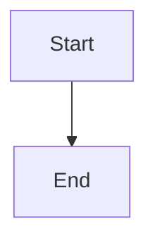

<objective>
Create the requirements.txt and verify that mkdocs build --strict produces a clean static documentation site using the configuration and theme assets from plan 02-01.

Purpose: Plan 02-01 provides the mkdocs.yml and theme assets. This plan provides the Python dependency declaration and end-to-end proof that `mkdocs build` works — the gate that confirms Phase 2 is complete.

Output: A pinned requirements.txt and a verified clean mkdocs build.
</objective>

<execution_context>
@$HOME/.claude/get-shit-done/workflows/execute-plan.md
@$HOME/.claude/get-shit-done/templates/summary.md
</execution_context>

<context>
@.planning/workstreams/doc-template/ROADMAP.md
@.planning/workstreams/doc-template/REQUIREMENTS.md
@.planning/workstreams/doc-template/PROJECT.md

Plan 02-01 (already complete before this runs) creates:
- ../gendoc-template/mkdocs.yml — Material theme config with gendoc.yml hook
- ../gendoc-template/scripts/load_gendoc_config.py — reads gendoc.yml at startup
- ../gendoc-template/stylesheets/extra.css — GNUS brand colors
- ../gendoc-template/javascripts/*.js — all five JS integrations

Reference requirements.txt:
@/Users/Shared/SSDevelopment/Development/GeniusVentures/GeniusNetwork/documentation/requirements.txt

Key versions from reference:
- mkdocs==1.6.1
- mkdocs-material==9.5.27
- pymdown-extensions>=10.14
- mkdocs-literate-nav==0.6.1

The build verification creates a temporary host project structure since the template is a submodule that expects a parent host project. The gendoc.yml hook resolves `paths.handwritten_docs` relative to the host project root (one level above the template).
</context>

<tasks>

<task type="auto">
  <name>Task 1: Create requirements.txt with pinned Python dependencies</name>
  <files>../gendoc-template/requirements.txt</files>
  <action>
    Create `gendoc-template/requirements.txt` with the exact dependencies needed to run the mkdocs.yml configuration from plan 02-01. Derive from the reference `documentation/requirements.txt` but drop dependencies not used by the Phase 2 template.

    Required (keep — these are configured in mkdocs.yml):
    - `mkdocs==1.6.1` — MkDocs core (pinned to match reference)
    - `mkdocs-material==9.5.27` — Material theme (pinned to match reference)
    - `pymdown-extensions>=10.14` — provides superfences, highlight, arithmatex, emoji, etc. (lower-bound pin — these extensions are stable)
    - `mkdocs-literate-nav==0.6.1` — navigation from SUMMARY.md (pinned)

    Not required (drop — not configured in Phase 2 mkdocs.yml):
    - `pygments` — pulled in by mkdocs-material as a transitive dependency, no need to pin explicitly
    - `mkdocs-redirects` — Phase 2 does not configure the redirects plugin
    - `mkdocs-section-index` — Phase 2 does not configure section-index
    - `mkdocs-exclude` — Phase 2 does not configure exclude
    - `mkdocs-git-revision-date-localized-plugin` — Phase 2 does not configure this plugin
    - `mkdocs-literate-nav` (duplicate entry in reference) — single entry is sufficient

    Also add:
    - `pyyaml>=6.0` — needed by the load_gendoc_config.py hook to parse gendoc.yml (pyyaml is typically installed as a transitive dep but declaring it explicitly documents the dependency)

    Each package on its own line, no comments needed — the file is self-documenting by its contents.

    ```text
    mkdocs==1.6.1
    mkdocs-material==9.5.27
    pymdown-extensions>=10.14
    mkdocs-literate-nav==0.6.1
    pyyaml>=6.0
    ```
  </action>
  <verify>
    <automated>bash -c '
      REQ="/Users/Shared/SSDevelopment/Development/GeniusVentures/GeniusNetwork/gendoc-template/requirements.txt"
      test -f "$REQ" || { echo "FAIL: requirements.txt missing"; exit 1; }

      echo "=== CHECK: Required packages present ==="
      grep -q "^mkdocs==" "$REQ" || { echo "FAIL: mkdocs missing"; exit 1; }
      grep -q "^mkdocs-material==" "$REQ" || { echo "FAIL: mkdocs-material missing"; exit 1; }
      grep -q "pymdown-extensions" "$REQ" || { echo "FAIL: pymdown-extensions missing"; exit 1; }
      grep -q "mkdocs-literate-nav" "$REQ" || { echo "FAIL: mkdocs-literate-nav missing"; exit 1; }
      grep -q "pyyaml" "$REQ" || { echo "FAIL: pyyaml missing"; exit 1; }

      echo "=== CHECK: Non-empty and correctly formatted ==="
      LINES=$(wc -l < "$REQ" | tr -d " ")
      test "$LINES" -ge 5 || { echo "FAIL: less than 5 lines"; exit 1; }
      # Each line should be a valid pip requirement
      while IFS= read -r line; do
        test -z "$line" && continue
        echo "$line" | grep -qE "^[a-zA-Z0-9_-]+[><=~!]" || { echo "FAIL: invalid requirement format: $line"; exit 1; }
      done < "$REQ"

      echo "=== ALL CHECKS PASSED ==="
    ' 2>&1</automated>
  </verify>
  <done>requirements.txt exists with 5 pinned/lower-bound packages: mkdocs, mkdocs-material, pymdown-extensions, mkdocs-literate-nav, pyyaml. All use valid pip requirement format.</done>
</task>

<task type="auto">
  <name>Task 2: Verify mkdocs build produces a clean static site</name>
  <files>../gendoc-template/requirements.txt</files>
  <action>
    Run a full end-to-end verification that mkdocs build succeeds with the Phase 2 configuration.

    Steps:

    1. **Create a virtual environment and install dependencies:**
       ```bash
       cd /Users/Shared/SSDevelopment/Development/GeniusVentures/GeniusNetwork/gendoc-template
       python3 -m venv .venv
       source .venv/bin/activate
       pip install -r requirements.txt
       ```

    2. **Create a temporary host project structure** (since the template is a submodule, the hook resolves paths relative to the host project root — one level up):
       ```bash
       TEMP_HOST="/tmp/gendoc-test-host"
       mkdir -p "$TEMP_HOST/docs"
       # Move template into position as a submodule
       cp -r /Users/Shared/SSDevelopment/Development/GeniusVentures/GeniusNetwork/gendoc-template "$TEMP_HOST/gendoc-template"
       ```

    3. **Create minimal test content** so mkdocs has pages to build:
       - `$TEMP_HOST/docs/index.md`:
         ```markdown
         # Test Project

         Welcome to the test documentation site.

         ## Mermaid Test

         ```mermaid
         graph TD
             A[Start] --> B[End]
         ```

         ## Math Test

         $$E = mc^2$$
         ```
       - `$TEMP_HOST/docs/SUMMARY.md`:
         ```markdown
         - [Home](index.md)
         ```

    4. **Set gendoc.yml values for the test host project:**
       - `project.name: "Test Project"`
       - `paths.handwritten_docs: "docs"`

    5. **Run mkdocs build from the template directory:**
       ```bash
       cd "$TEMP_HOST/gendoc-template"
       source /Users/Shared/SSDevelopment/Development/GeniusVentures/GeniusNetwork/gendoc-template/.venv/bin/activate
       mkdocs build --strict 2>&1
       ```

    6. **Verify build output:**
       - Exit code is 0 (zero errors, zero warnings with --strict)
       - `site/` directory exists
       - `site/index.html` exists (the main page)
       - `site/search/search_index.json` exists (search plugin output)
       - `site/assets/javascripts/bundle/` has JS bundles (Material theme output)
       - `site/assets/stylesheets/` has CSS (Material theme + extra.css output)

    7. **Verify gendoc.yml integration:**
       - Confirm the site title in the generated HTML matches the gendoc.yml `project.name` value ("Test Project" in `<title>`)
       ```bash
       grep -q "<title>Test Project" "$TEMP_HOST/gendoc-template/site/index.html" || echo "WARN: site title not from gendoc.yml"
       ```

    8. **Clean up:**
       ```bash
       rm -rf "$TEMP_HOST"
       ```

    If mkdocs build fails at any point, diagnose and fix the offending file. Common causes:
    - Invalid YAML syntax in mkdocs.yml
    - Missing CSS/JS files referenced in extra_css or extra_javascript
    - Plugin version mismatch (requirements.txt pins should prevent this)
    - Hook script exception (check Python traceback)

    This is a verification loop task — the primary deliverable is proof that the system works end-to-end.
  </action>
  <verify>
    <automated>bash -c '
      set -e
      ROOT="/Users/Shared/SSDevelopment/Development/GeniusVentures/GeniusNetwork/gendoc-template"
      TEMP_HOST="/tmp/gendoc-test-host-$$"

      echo "=== Setting up test environment ==="
      # Create venv if not exists
      if [ ! -d "$ROOT/.venv" ]; then
        python3 -m venv "$ROOT/.venv"
      fi
      source "$ROOT/.venv/bin/activate"
      pip install -q -r "$ROOT/requirements.txt" 2>&1 | tail -1

      echo "=== Creating host project structure ==="
      mkdir -p "$TEMP_HOST/docs"
      cp -r "$ROOT" "$TEMP_HOST/gendoc-template"

      # Create test docs
      cat > "$TEMP_HOST/docs/index.md" << "DOCEOF"
# Test Project

Welcome to the test documentation site.

## Mermaid Test



## Math Test

$$E = mc^2$$
DOCEOF

      cat > "$TEMP_HOST/docs/SUMMARY.md" << "SUMEOF"
- [Home](index.md)
SUMEOF

      # Update gendoc.yml project name for the test
      python3 -c "
import yaml
path = \"$TEMP_HOST/gendoc-template/gendoc.yml\"
with open(path) as f:
    cfg = yaml.safe_load(f)
cfg[\"project\"][\"name\"] = \"Test Project\"
with open(path, \"w\") as f:
    yaml.dump(cfg, f, default_flow_style=False, sort_keys=False)
"

      echo "=== Running mkdocs build --strict ==="
      cd "$TEMP_HOST/gendoc-template"
      if mkdocs build --strict 2>&1; then
        echo "BUILD SUCCESS"
      else
        echo "BUILD FAILED"
        rm -rf "$TEMP_HOST"
        exit 1
      fi

      echo "=== Verifying build output ==="
      test -d "site" || { echo "FAIL: site/ directory missing"; exit 1; }
      test -f "site/index.html" || { echo "FAIL: site/index.html missing"; exit 1; }
      test -f "site/search/search_index.json" || { echo "FAIL: search index missing"; exit 1; }

      # Check JS bundles exist
      JS_BUNDLES=$(find site/assets/javascripts -name "bundle*.js" 2>/dev/null | wc -l | tr -d " ")
      if [ "$JS_BUNDLES" -eq 0 ]; then
        echo "FAIL: no JS bundles found"
        exit 1
      fi
      echo "JS bundles: $JS_BUNDLES"

      # Check CSS exists
      CSS_COUNT=$(find site/assets/stylesheets -name "*.css" 2>/dev/null | wc -l | tr -d " ")
      if [ "$CSS_COUNT" -eq 0 ]; then
        echo "FAIL: no CSS found"
        exit 1
      fi
      echo "CSS files: $CSS_COUNT"

      # Verify gendoc.yml site_name integration
      if grep -q "<title>Test Project" site/index.html; then
        echo "PASS: site title loaded from gendoc.yml"
      else
        echo "WARN: site title may not be from gendoc.yml"
      fi

      echo "=== Cleanup ==="
      cd /
      rm -rf "$TEMP_HOST"

      echo "=== ALL VERIFICATIONS PASSED ==="
    ' 2>&1</automated>
  </verify>
  <done>mkdocs build --strict succeeds with zero errors, produces site/ with index.html, search index, JS bundles, and CSS. The site title reflects the gendoc.yml project.name value. Clean build output confirmed.</done>
</task>

</tasks>

<threat_model>
## Trust Boundaries

| Boundary | Description |
|----------|-------------|
| None | This plan creates requirements.txt and runs mkdocs build in an isolated temp directory. No runtime code, no network endpoints, no user data. The build verification creates and destroys a temporary host project structure. |

## STRIDE Threat Register

| Threat ID | Category | Component | Disposition | Mitigation Plan |
|-----------|----------|-----------|-------------|-----------------|
| T-02-SC | Tampering | pip install from requirements.txt | accept | This is a development-time verification, not a deployment. Package pins (== for major deps, >= for stable extensions) reduce supply-chain risk. Full supply-chain audit belongs to Phase 5 when the build script formalizes installation. |
</threat_model>

<verification>
## Source Audit

| SOURCE | ID | Feature/Requirement | Plan | Status | Notes |
|--------|----|---------------------|------|--------|-------|
| REQ | MKD-03 | Site works both locally (mkdocs serve) and built for deployment (mkdocs build) | 02-02 | COVERED | Task 1 creates requirements.txt enabling pip install; Task 2 runs mkdocs build --strict end-to-end and verifies build output |
| GOAL | — | MkDocs with Material theme renders a GNUS-styled site from host project hand-written markdown docs | 02-02 | COVERED | Task 2 verifies the complete pipeline: pip install → mkdocs build → inspect output. Confirms the site renders with gendoc.yml-driven site_name. |

Both Phase 2 requirements (MKD-01, MKD-03) are now fully covered across plans 02-01 and 02-02.
</verification>

<success_criteria>
1. `requirements.txt` contains mkdocs==1.6.1, mkdocs-material==9.5.27, pymdown-extensions>=10.14, mkdocs-literate-nav==0.6.1, and pyyaml>=6.0
2. `mkdocs build --strict` runs with exit code 0 (zero errors, zero warnings) in a clean temp environment
3. The built `site/` directory contains: index.html, search/search_index.json, JS bundles under assets/javascripts/, and CSS under assets/stylesheets/
4. The generated site title reflects the gendoc.yml project.name value (confirming the hook works end-to-end)
5. All temp artifacts are cleaned up after verification
</success_criteria>

<output>
Create `.planning/workstreams/doc-template/phases/02-mkdocs-site/02-02-SUMMARY.md` when done
</output>
