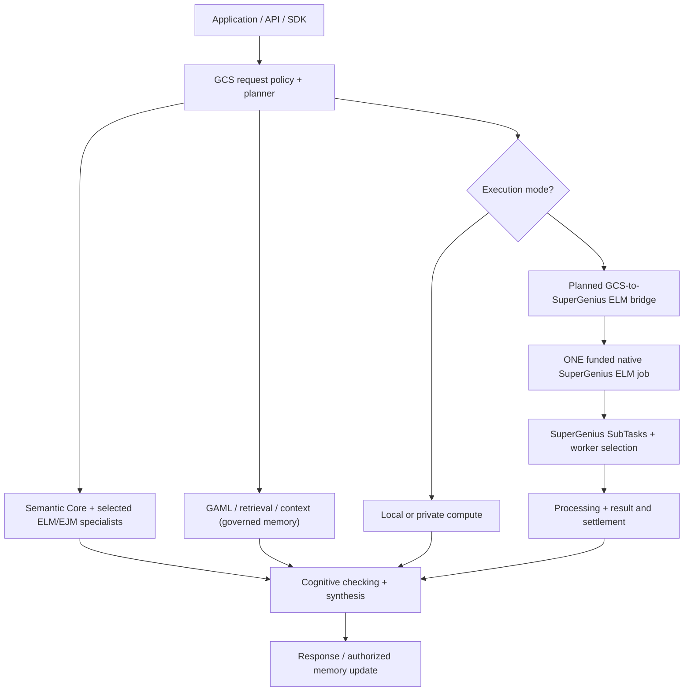

# GNUS.ai and GCS: Architecture at a Glance

**Reviewed: October 9, 2026.** **Conceptual architecture, not a deployment diagram or proof of completed integrations.** This is the first-read technical guide for developers, customers, and reviewers.

## The idea in two paragraphs

GNUS.ai combines **SuperGenius**, a distributed processing, trust, and GNUS settlement platform, with **Genius Cognitive System (GCS)**, a modular approach to AI work. GCS is intended to select a Semantic Core, compact Expert Language Models (ELMs) and other specialist capabilities, authorized memory, tools, and checks that each task needs. The goal is to avoid paying for a large generic model on every step when a smaller qualified specialist could suffice.

GCS plans the work. SuperGenius owns native processor selection, SubTask scheduling, peer networking, and accounting **when a request actually needs public distributed execution**. A local or tenant-private request might never use a public node, escrow transaction, or on-chain proof. A conceptual arrow does not imply that each component already runs in one complete production stack.

## Boundaries readers should not confuse

| Question | Responsible system | Caution |
| --- | --- | --- |
| What experts, memory, and checks are needed? | GCS orchestration | The broad roadmap is not equivalent to a deployed GCS controller. |
| Which native worker gets a distributed task? | SuperGenius processing | Do not implement a second SuperGenius scheduler per ELM. |
| Did a worker run the declared model and kernel? | Planned GCS Execution Integrity System (EIS), with runtime evidence | EIS specification is still draft and not a published cross-GPU attestation result. |
| Is an answer correct? | GCS grounding, semantic verification, arbitration | Not the same as matching execution hashes or ledger consensus. |
| Is network state authorized, and who gets paid? | SuperGenius consensus and settlement | Neither implies answer quality. |
| Can a consumer access /v1 Chat Completions? | Planned OpenAI-compatible GCS gateway | v1.1 Phase 6 is not a publicly operational service. |

## Real implementation versus the plan

**Built software exists**, including SuperGenius processing/ledger sources, NEO-SWARM C++ inference/routing modules and tests, and GCS Chat C++/Flutter messaging foundations. **The full cognitive system, governed GAML memory, EIS and OpenAI-compatible retail API are not established as deployed and integrated in the current system workstream.** Consult [Implementation Status](IMPLEMENTATION-STATUS.md), [Performance and Benchmarks](PERFORMANCE-BENCHMARKS.md), and [Document Index](DOCUMENT-INDEX.md) for evidence and limitations.

**Canonical context:** [GCS System Overview](system-overview.md) · [Native bridge specification](developer-api-and-compute-bridge.md) · [GNUS Platform Status](https://docs.gnus.ai/about-gnus.ai/release-status/) · [SuperGenius issue #369](https://github.com/GeniusVentures/SuperGenius/issues/369).
